## 五子棋Ai

学习react的时候，看到了一个井字棋的案例，感觉挺有意思，就想着自己写个五子棋试试，于是在磕磕碰碰中终于完成现在这个五子棋ai。

#### 结构：
整个结构非常简单，只有ai和ui两部分，ui部分就不多说了，我偷了个懒，棋盘是ps做的图片，棋子就是css写个圆设置不同的背景颜色，这部分是vue写的，直接看源码`board.vue`
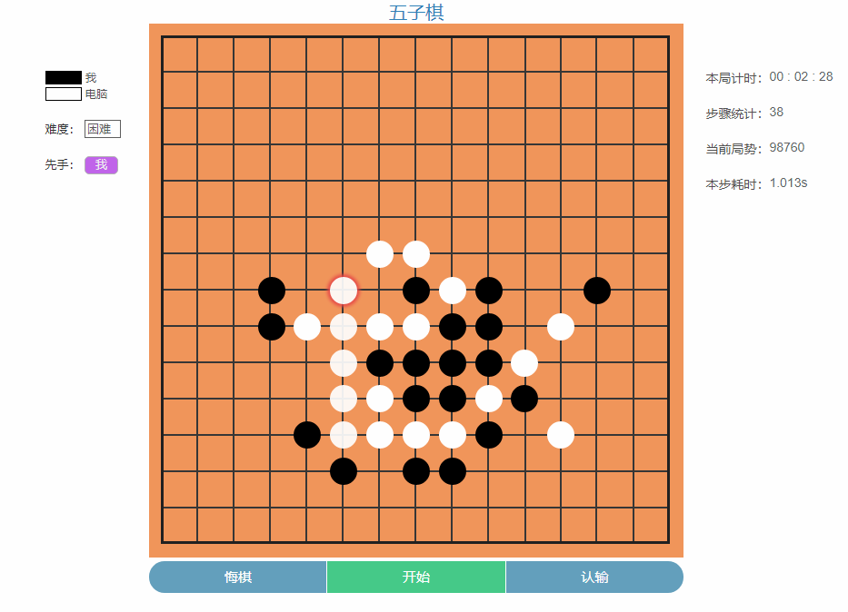

#### ai部分：
在写这个之前我们先分析一下这个东西该怎么写。首先要有一个东西来代表棋盘和棋子，这里我们采用二维数组，这样就能组成一个矩阵，矩阵各交叉点代表可下子部位。

```javascript
// 部分代码
class Matrix {
  constructor (size) {
    let matrix = []
    for (let row = 0; row < size; row++) {
      matrix[row] = []
      for (let col = 0; col < size; col++) {
        matrix[row][col] = 0
      }
    }
    this.matrix = matrix
  }
  /* 
    ...
  */
}
```

以我们正常人的下棋思维，下一步棋考虑的是我们这步棋会给我们带来多少收益，而写程序就需要用数字来代替这个收益，也就是这步棋能得多少分，这就需要我们有一个评分函数，这就很明了了，我们就先写一个评分函数。

>评分规则

五子棋的规则很简单，只要是能水平、垂直、斜方向有连续五个同色的棋子就为赢，也就是我们所称的连五。除此之外，还有一些再加若干棋子就能组成连五的棋型。如：

 连五：五颗同色棋子连在一起

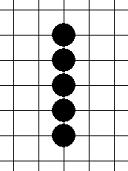

 活四：有两个连五点

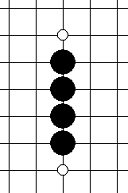

死四：只有一个连五点

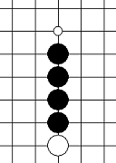
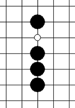
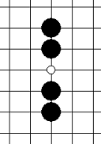

活三：能组成活四的三称为活三

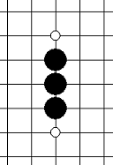
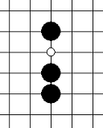

死三：能组成死四的三

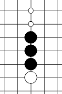
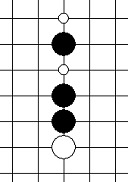
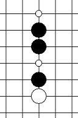

活二：能组成活三的二

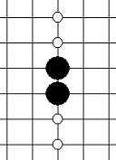
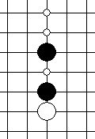
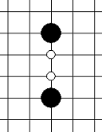

死二：能组成死三的二

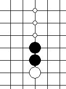


我们给这些棋型都给定一个分数：
* 连五： 100000
* 活四： 10000
* 死四： 1000
* 活三： 1000
* 死三： 100
* 活二： 100
* 死二： 10

>单点评分

在下一步棋时，我们通常会观察四周是否有同样颜色的棋子，从而组成各种高分值的棋型。人是凭眼睛看的，而计算机就只能在棋盘上遍历了。我们分别遍历需要评分的点的水平、垂直、斜防线两边各四个点，然后判断组成的棋型，从而获取评分。

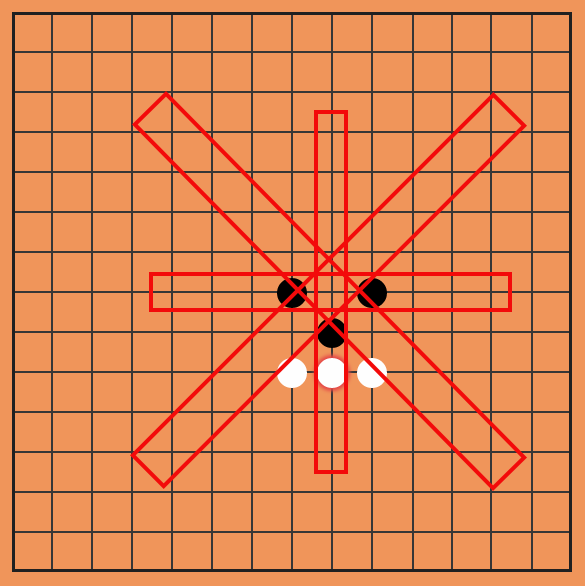

如图，以[7, 8]点为中心，分别向八个方向遍历，获取棋型，从而判断该点得分。

这里，得分机制都是一个重点。我们要分别获取我方跟敌方的棋型，对于我方来说，落一个子可能是把活二变成活三，这里可以叫做进攻分。而对于敌方来说就是阻止了敌方组成活三的可能，这里可以叫防守分。而单点的评分就是八个方向的进攻分和防守分的总和。

通常进攻分跟防守分是一致的，比如组成活二跟阻止敌方组活三都给予100分，但有的时候防守要比进攻更重要，比如敌方组成活三，如果我们不去防守活三下一步活三就会变成无法阻止的活四，这个时候明显阻止敌方组成活四比自己组成活三要重要，所以这里我们给的防守分要高于进攻分。
详情参考源码`evaluate_points.js`。

>棋型判断

棋型判断是比较麻烦的，因为五子棋棋型还挺多的。在研究棋型的时候我发现连五只有一种情况，可以很容易判断，活四跟死四都是加一个子后就能组成连五，区别是一个有两个连五点，一个只有一个连五点，通过这点可以判断死四跟活四。活三是加一个子能组成活四，死三是加一个子组成死四，以此类推，通过不断的添加棋子，直到能组成一个可以判断的棋型为止，从而推断当前棋型是那种。这里，我们采用的是递归：

详情参考源码`chess_model.js`
```javascript
// 部分代码
var chessModel = function (array, currentChess, deep) { // 判断棋型
  var _deep = deep - 1 // deep值可以限制最大增子数
  var best = Infinity

  var winFive = isWinFive(array, currentChess) // 判断连五
  if (winFive) {
    return 0
  }

  var isAlivefour = fourToFive(array, currentChess)
  if (Math.abs(isAlivefour) === 1) { // 判断死四/活四
    return isAlivefour
  }

  if (deep <= 0) return Infinity // 搜索层数限制

  for(let i = 0, len = array.length; i < len; i++) {
    if (array[i] == STR_NUM.EMPTY) {
      array[i] = currentChess
      var score = chessModel(array, currentChess, _deep)
      array[i] = STR_NUM.EMPTY
      score > 0 ? score++ : score--
      if (Math.abs(score) < Math.abs(best)) best = score // 找出所有结果里的最小值 
      if (Math.abs(score) === Math.abs(best)) best = score < best ? best : score // 相等时取正值
    }
  }
  return best
}
```

上面的方法时间复杂度有点高，希望有更好的判断棋型的方法。

单点评分完成后，我们就可以选择分数比较高的点下子，可是这是只顾眼前和局部局势，并不能长远的全局的考虑棋局走向，因此胜率也不高，因此，我们还要在下棋时要给整个棋盘打分，并且要多考虑几步。

>极小极大值搜索

五子棋是双方依次下子，并且整个局面双方都能知道的类型，因此我们可以提前预知接下来局势走向的所有可能性。
极小极大值搜索就可以用在这种情况中。我们可以搜索出n步棋以后所有可能出现的局势，并评估出所有局势的分数，得到其中的最高分，这样我们就能找到最优的走法。然而，正常情况下，对手不会走利于我方的步骤，而是尽量让局势分降低，所以我们在获取最终得分后要采用一定的方法向上传递，从而获取最优解。这种搜索方法可以用树状图表示，如下图：

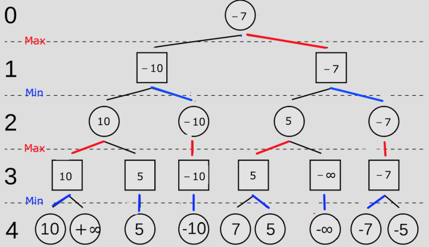

由于算力的限制，搜索的层数是有限的，图上列出搜索四层的所有可能。第4层得分就是4步后各种走法的最终得分，如果只看最终得分的话我们会认为最终的得分+∞走法是最优的，然而有一半的步骤是对手走的，而对手是不期望我方能得到高分，因此不可能按照设想的的最优步骤来走。就如上图，第4层是对手所有可能的步骤，对手期望降低得分，因此会选取该分支的最小值，我们称该层为min层。第3层是我方所有可能的步骤，我方期待获取更大的得分，因此会选取该分支的最大值，我们称该层为max层。

第4层第一个分支有10和+∞两个值，选取该分支最小值得到就是10，而10就作为该分支的得分传递到第3层，其他分支同理，把值都传入第3层，而第3层则是取各分支的最大值传递到第2层，重复这样的步骤直至得到最终得分，获取这个得分所走的步骤就是接下来我们要走的最优步骤。我们用一个递归来模拟这个过程。

详情参考源码`negamax.js`
```javascript
// 部分代码
var minimax = function (board, chess, role, deep) {
  /*
    board 整个棋局
    chess 当前棋子
    role role > 0该层是max层，role < 0该层是min层
    deep 搜索层数
  */
  // 超出层数直接获取评估分
  if (deep <= 0) {
    let score = evaluate(board) // 全局评分函数
    return score
  }

  let best = role > 0 ? -Infinity : Infinity
  let _chess = switch(chess) // 切换棋色
  let _deep = deep - 1 // 层数减一
  let points = pointsGet() // 获取所有可能走的点
  for (let i = 0; i < points.length; i++) {
    board.put(points[i].row, points[i].col, chess) // 下一步棋
    let score = minimax(board, _chess, -role, _deep)
    if (role > 0 && score > best) { // role > 0说明此层是max层，取最大值
      best = score
    }
    if (role < 0 && score < best) { // role < 0说明此层是min层，取最小值
      best = score
    }
  }
  return best
}
```
使用minimax搜索后，棋力会大幅的提高，同时由于搜索的分支比较多，速度也会大幅度下降，因此还要想办法剪除一些不必要的分支。

>alpha-beta剪枝

minimax搜索是把所有的走法都枚举了出来，有些明显不利的走法被搜索，很明显这些走法我们可以不搜索，以提高搜索效率。体现在棋局中，就是一些明显不利的走法是不会去走的。这里我们采用alpha-beta剪枝，如图：

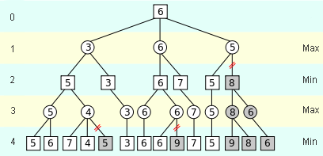

minimax搜索采用的是深度优先型，在获取左侧节点的值后才会去获取右侧节点的值，由于节点的值是由其分支决定的，我们可以把左侧节点的值去跟右侧节点分支做比较，来判断分支是否是有效分支。

在max层中，我们把左侧节点中的最大值称为alpha，如果右侧节点的分支比alpha要小，就说明右侧节点的值无论如何都不会大于左侧节点的值，而max层需要取的是最大值，所以说这个节点是无效的，其剩余分支也无需被搜索。如果右侧节点的值大于其左侧的值，则该值就是该层中节点最大值，alpha的值也相应的更改为这个值。

在min层中，我们把左侧节点中的最小值称为beta，如果右侧节点的分支比beta要大，就说明右侧节点的值无论如何都不会小于左侧节点的值，而min层需要取的是最小值，所以说这个节点是无效的，其剩余分支也无需被搜索。如果右侧节点的值小于其左侧值，则该值就是该层中节点最小值，beta的值也相应的更改为这个值。

上图中，第3层是max层，其左侧节点值为5，所以暂定alpha = 5，而右侧节点第2个分支值为4，其节点值必然是小于或等于4的，显然也小于alpha，所以该节点是无效的，后面的分支5也无需再被搜索。

代码也很简单，只要在搜索代码里加上剪枝条件
```javascript
// 部分代码
var minimax = function (board, chess, role, deep, _alpha, _beta) {
  /*
    _alpha alpha值
    _beta beta值
  */
  
  if (deep <= 0) {
    let score = evaluate(board)
    return score
  }

  let best = role > 0 ? -Infinity : Infinity
  let _chess = switch(chess)
  let _deep = deep - 1
  let points = pointsGet() // 单点评分，提前排序
  
  let alpha = _alpha, beta = _beta

  for (let i = 0; i < points.length; i++) {
    board.put(points[i].row, points[i].col, chess)
    let score = minimax(board, _chess, -role, _deep, alpha, beta)

    if (role > 0 && score > beta || role < 0 && score < alpha) { // 剪枝（剪枝是在节点层进行）
      best = score
      break
    }

    if (role > 0 && score > best) {
      best = score
      alpha = score // 最大值大于alpha则更改传入下层的alpha值
    }
    if (role < 0 && score < best) {
      best = score
      beta = score // 最小值小于beta则更改传入下层的beta值
    }
  }
  return best
}
```
加上alpha-beta剪枝后，需要搜索的节点大幅度减少，提高了计算速度。然而alpha-beta剪枝有一个缺点，它需要节点按照需要的顺序搜索，才能更有效的剪除无效分支。例如，我们假设alpha = 5，其右侧节点有3个分支，分别为4，6，8，按照剪枝算法，我们可以在搜索第一个分支时就知道该节点最终值是小于最大值的，其剩下的两个分支就无需计算。但是，如果该节点三个分支排列顺序为8，6，4，我们搜索到第一个分支时就无法判断节点的最终值是小于最大值的，因此还需要继续搜索分支。由此可见，节点分支的顺序排列对提高剪枝效率是非常有必要的。因此，我们需要提前大致评估一下每个节点的分值，提前排好顺序，这样能有效的提高剪枝效率。这就需要我们前面所说的单点评分。

>全局评分

前面说了很多搜索的问题，而搜索里有一个重要的核心就是分值评估。因此，接下来要说的就是这个全局评估。

五子棋的全局评估我没什么好的办法，就是搜索所有棋子，分别计算每行每列每斜行的我方得分和对手得分，然后使用我方得分减去对手得分，最后得到的分数就是当前局势分。这里，我说一下单行的评分。

对于单行的评分，我的评估方式有些复杂，我采取的方法是根据空格把每行同颜色的棋子拆分成若干份，然后排列出这若干份棋子的所有组合，分别计算这些组合的得分，然后取出最高分作为当前行得分。这个是一个笨方法，希望大家有更好的方法。这部分代码参考`score.js`

>局部刷新

前面全局评分是对棋盘每行每列没斜行都进行评分，然而每步棋棋盘都只有很少一部分改动，因此我们只需要评估这改动的分数，也一样能达到评分的目的。

我们需要把每行每列每斜行的分值分别保存起来，当棋局发生改变时，只需要把改动的行列的分值进行刷新就可以了。参考代码`evaluate_situation.js`

#### 总结

本次项目还有很多未实现的东西，比如说算杀，但基本的棋类ai算是实现。本次主要收获是理解了极小极大值算法，alpha-beta剪枝，对写棋类ai有了一定的经验。（下五子棋水平也大幅度提高啊，认识的人已经没人是我对手了，笑）
